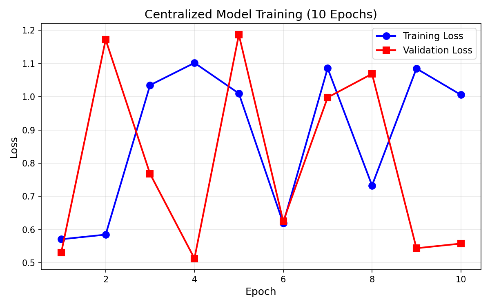
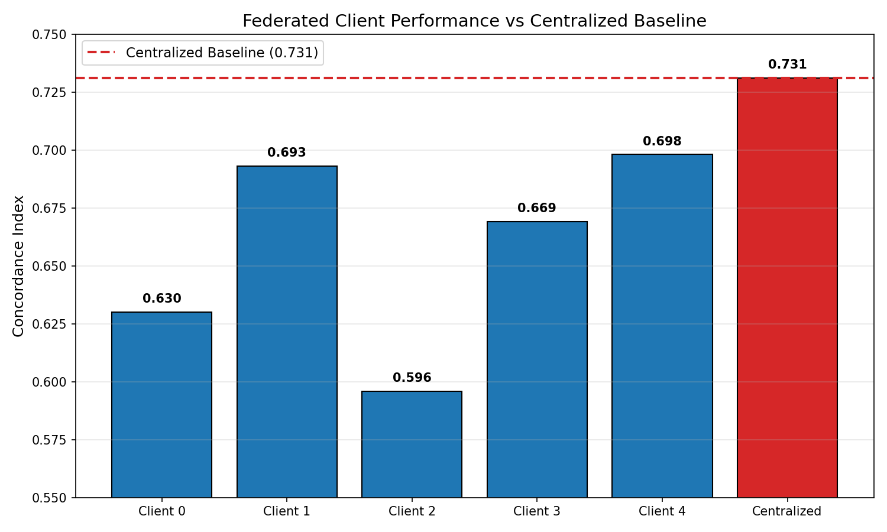
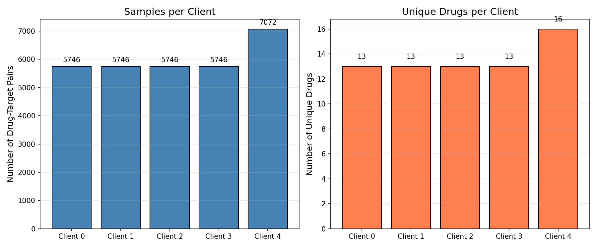
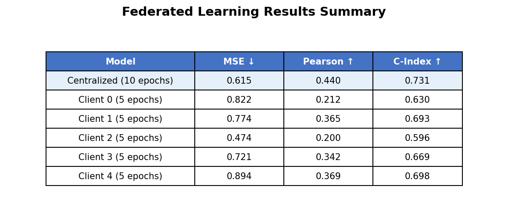

# Federated Learning for Drug-Target Interaction Prediction

## Overview
This project implements federated learning (FedAvg) for drug-target interaction prediction using the DAVIS dataset. The data is split into 5 non-IID clients based on drug assignment, simulating real-world heterogeneity across institutions.

## Results

### Centralized Baseline (10 epochs)
- **Concordance Index:** 0.731
- **Test MSE:** 0.615
- **Pearson Correlation:** 0.440

### Federated Clients (5 epochs each)
| Client | Samples | Unique Drugs | MSE | Pearson | C-Index |
|--------|---------|--------------|-----|---------|---------|
| Client 0 | 5,746 | 13 | 0.822 | 0.212 | 0.630 |
| Client 1 | 5,746 | 13 | 0.774 | 0.365 | 0.693 |
| Client 2 | 5,746 | 13 | 0.474 | 0.200 | 0.596 |
| Client 3 | 5,746 | 13 | 0.721 | 0.342 | 0.669 |
| Client 4 | 7,072 | 16 | 0.894 | 0.369 | 0.698 |

## Visualizations

| Centralized Training | Federated vs Centralized |
|:--------------------:|:------------------------:|
|  |  |

| Client Data Distribution | Performance Summary |
|:------------------------:|:-------------------:|
|  |  |

## Technologies
- Python 3.8+
- DeepPurpose (TensorFlow/Keras backend)
- NumPy, Pandas, Matplotlib
- scikit-learn

## How to Run

```bash
# Install dependencies
pip install -r requirements.txt

# Run centralized baseline
python experiments/run_centralized.py

# Run federated learning simulation
python experiments/run_federated.py

# Generate all plots
python experiments/generate_plots.py
``` 