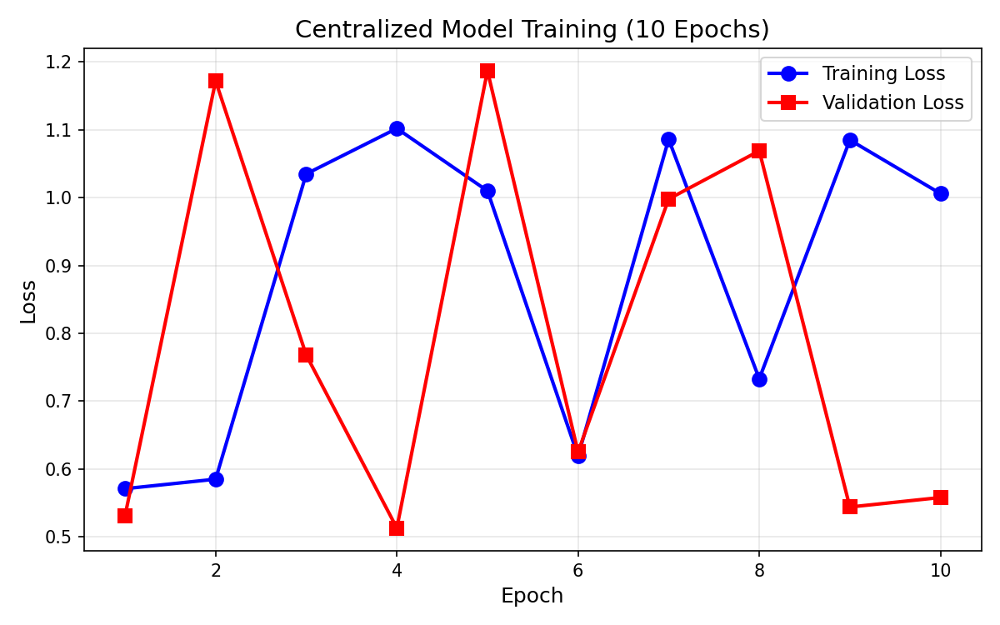
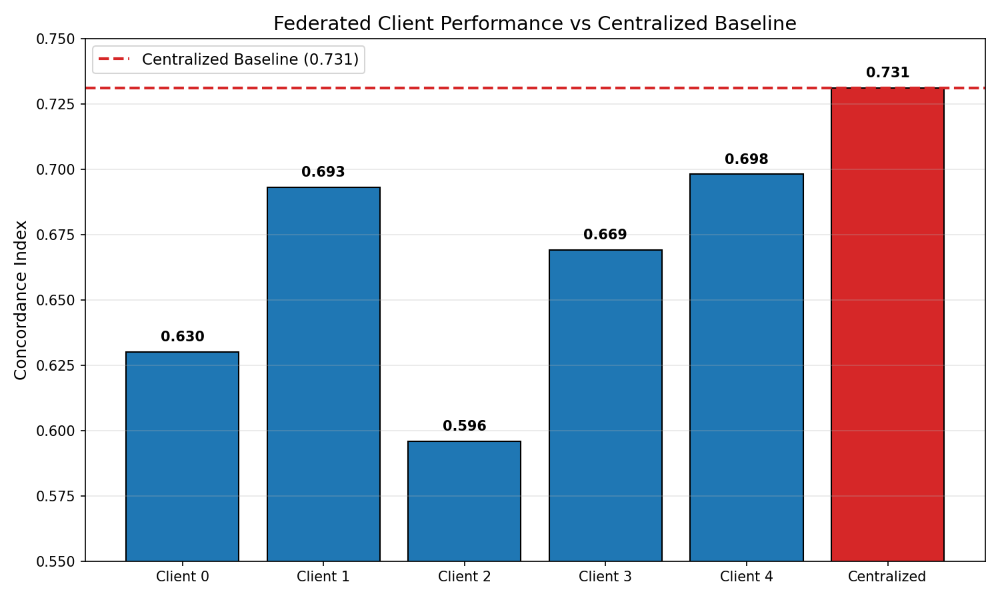
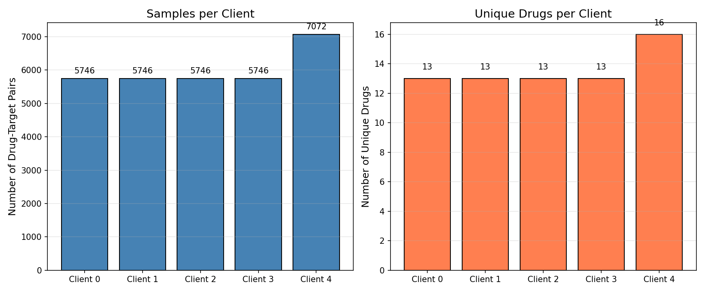
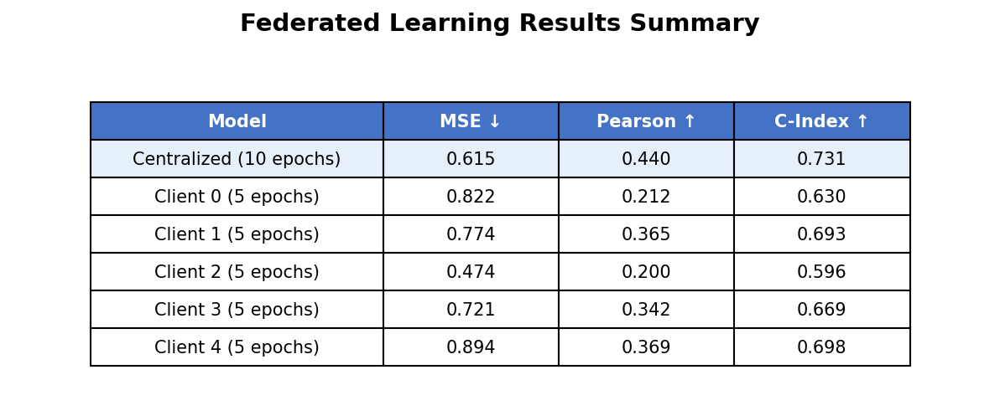

# Federated Learning for Drug-Target Interaction Prediction

## Architecture Implementation (Work in Progress)
This project implements the **architecture** for federated learning (FedAvg) for drug-target interaction prediction using the DAVIS dataset. The current implementation includes:

- ✅ Data loading and preprocessing (DAVIS dataset)
- ✅ Non-IID client partitioning (drug-based)
- ✅ Centralized baseline training
- ✅ FL Client/Server class structure
- ✅ Model weight management infrastructure

### Under Development

The **full FedAvg communication rounds** (clients sending weights to server, server aggregating, distributing back) are currently being implemented. The current code simulates independent client training to demonstrate the performance gap between centralized and isolated training.


### 📊 Current Results

### Centralized Baseline (10 epochs)
- **Concordance Index:** 0.731
- **Test MSE:** 0.615
- **Pearson Correlation:** 0.440

### Client Performance (Independent Training)
| Client | Samples | Unique Drugs | MSE | Pearson | C-Index |
|--------|---------|--------------|-----|---------|---------|
| Client 0 | 5,746 | 13 | 0.822 | 0.212 | 0.630 |
| Client 1 | 5,746 | 13 | 0.774 | 0.365 | 0.693 |
| Client 2 | 5,746 | 13 | 0.474 | 0.200 | 0.596 |
| Client 3 | 5,746 | 13 | 0.721 | 0.342 | 0.669 |
| Client 4 | 7,072 | 16 | 0.894 | 0.369 | 0.698 |

*These results demonstrate the performance variation across non-IID clients, highlighting the need for federated aggregation.*


## Visualizations

| Centralized Training | Federated vs Centralized |
|:--------------------:|:------------------------:|
|  |  |

| Client Data Distribution | Performance Summary |
|:------------------------:|:-------------------:|
|  |  |

### Key Observations

1. **Centralized performance gap**: Centralized model (C-Index: 0.731) outperforms individual clients (C-Index: 0.596–0.698), demonstrating the value of data sharing.
2. **Non-IID heterogeneity**: Client 2 shows the lowest C-Index (0.596) with only 0.200 Pearson correlation, highlighting the challenge of skewed drug distributions.
3. **Data imbalance**: Client 4 has the most samples (7,072) and unique drugs (16), correlating with the highest C-Index among clients (0.698).


### Project Structure
```
federated-deeppurpose/
├── data/                              # DAVIS dataset
│   └── splits/                        # Fixed client/train/val/test split (indices)
├── experiments/
│   ├── run_centralized.py             # Centralized baseline
│   ├── run_local.py                   # Local-only baseline (no communication)
│   ├── run_federated.py               # FedAvg
│   └── generate_plots.py
├── federated/
│   ├── client.py                      # Local training from the global weights
│   ├── server.py                      # Sample-weighted FedAvg aggregation
│   └── fedavg.py                      # Communication rounds, checkpointing
├── utils/
│   ├── load_davis.py                  # Data loading
│   ├── data_split.py                  # Drug-based non-IID partition
│   ├── protocol.py                    # Shared train/val/test protocol, pKd transform
│   ├── features.py                    # DeepPurpose featurisation, cached protein encoding
│   ├── engine.py                      # Device, model, metrics, checkpoints, CSV logs
│   └── trainer.py                     # Epoch loop with resume (baselines)
├── notebooks/colab_run.ipynb          # Run on Google Colab
├── tests/
│   ├── smoke_test.py                  # Quick CPU test of all scripts + resume
│   └── verify_protein_cache.py        # Cached encoding == DeepPurpose encoding
├── results/                           # Visualizations
│   ├── centralized_loss_curve.png
│   ├── client_data_distribution.png
│   ├── combined_summary.png
│   ├── federated_comparison.png
│   └── performance_table.png
└── README.md
```

## 📝 Next Steps

- [x] Implement full FedAvg communication rounds with weight aggregation
- [x] Add cross-client evaluation metrics
- [ ] Run centralized / local-only / FedAvg on GPU
- [ ] Compare FL vs. local-only and centralized performance
- [ ] Prepare manuscript for publication (code will be released upon submission)


## Technologies
- Python 3.10
- DeepPurpose 0.1.5 (PyTorch backend), MPNN drug encoder + CNN protein encoder
- NumPy, Pandas, Matplotlib, scikit-learn, lifelines

## How to Run

All scripts use CUDA when available and fall back to CPU (`--device cpu|cuda` to force).

```bash
# Install (see requirements_fixed.txt for the tested local CPU environment)
conda create -n fedpurpose python=3.10 && conda activate fedpurpose
pip install torch==2.0.1 --index-url https://download.pytorch.org/whl/cpu
pip install -r requirements_fixed.txt
pip install --no-deps DeepPurpose==0.1.5

# Quick CPU checks
python tests/smoke_test.py
python tests/verify_protein_cache.py

# Experiments
python experiments/run_centralized.py --epochs 100 --output-dir outputs/centralized
python experiments/run_local.py       --epochs 100 --output-dir outputs/local
python experiments/run_federated.py   --rounds 30 --local-epochs 2 --output-dir outputs/fedavg

# Figures (currently from hard-coded earlier results; to be switched to the CSV outputs)
python experiments/generate_plots.py
```

Common options: `--resume`, `--seed`, `--lr`, `--batch-size`, `--num-workers`, `--subsample 0.05` (quick tests),
`--patience N` (early stopping: stop when val MSE has not improved for N epochs/rounds; off by default).
The reported model is always the one with the lowest validation MSE.

Two training choices (see `docs/NOTES.md` for why):
- **Output-bias initialisation (all methods):** the model's output bias starts at the mean training
  label (pKd), so training does not begin from predictions of ~0. In FedAvg this mean is the
  sample-weighted mean of the client label means. Disable with `--init-bias none`.
- **Client optimizer state (FedAvg):** each client keeps its own Adam state between rounds. Resetting
  Adam every round made all predictions swing up and down by 1–3 pKd from round to round. The old
  behaviour is available with `--reset-client-optimizer`.

Each run directory contains `config.json`, `last.pt` (checkpoint after every epoch/round), `best.pt`
(lowest validation MSE), `metrics.csv` (one row per epoch/round), `client_metrics.csv` (per-client
val/test metrics) and `final_metrics.json` (best model on val and test).
An existing run is never overwritten: add `--resume` to continue it, or use a new `--output-dir`.

All methods use the same split (`data/splits/protocol_seed42.csv`): each client's pairs are split
70/10/20 into train/val/test; the global val/test sets are the union of the client sets, and the
centralized model trains on the union of the client training sets.

## Running on Colab

Use Colab's GPU for long runs; keep a local CPU environment for development.

1. Push this repository to GitHub.
2. Open `notebooks/colab_run.ipynb` in Colab (File → Open notebook → GitHub) and select a GPU runtime.
3. In the config cells set `REPO_URL`, `EXPERIMENT` (`centralized`, `local` or `fedavg`), `RUN_NAME` and the hyperparameters.
4. Run all cells. The notebook mounts Google Drive, clones the repo, installs the extra packages
   without replacing Colab's PyTorch, and writes checkpoints and CSVs to
   `MyDrive/federated-deeppurpose/outputs/<RUN_NAME>/`.
5. If the session disconnects, run all cells again with the same `RUN_NAME`; training resumes from the last checkpoint.
